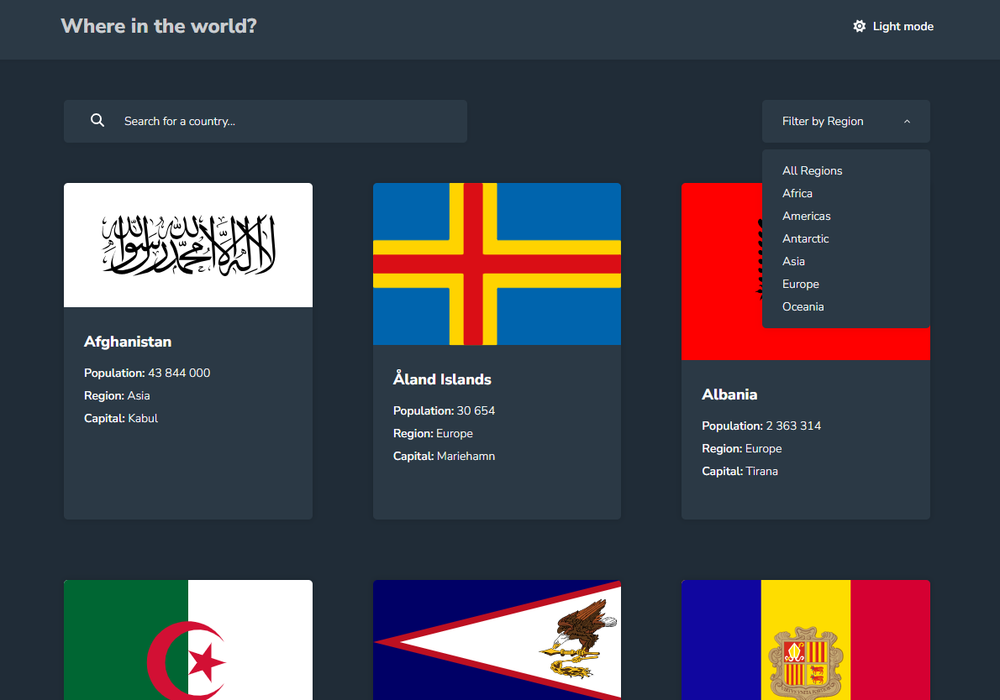

# Frontend Mentor - REST Countries API with color theme switcher solution

This is a solution to the [REST Countries API with color theme switcher challenge on Frontend Mentor](https://www.frontendmentor.io/challenges/rest-countries-api-with-color-theme-switcher-5cacc469fec04111f7b848ca). Frontend Mentor challenges help you improve your coding skills by building realistic projects.

## Table of contents

- [Overview](#overview)
  - [The challenge](#the-challenge)
  - [Screenshot](#screenshot)
  - [Links](#links)
- [My process](#my-process)
  - [Built with](#built-with)
  - [What I learned](#what-i-learned)
  - [Continued development](#continued-development)
  - [Useful resources](#useful-resources)
- [Author](#author)

## Overview

### The challenge

Users should be able to:

- See all countries from the API on the homepage
- Search for a country using an `input` field
- Filter countries by region
- Click on a country to see more detailed information on a separate page
- Click through to the border countries on the detail page
- Toggle the color scheme between light and dark mode _(optional)_

### Screenshot

### Links

- Solution URL: [GitHub Repo](https://github.com/morauszkia/fm-rest-countries)
- Live Site URL: [@Vercel](https://rest-countries-app-lemon.vercel.app/)

## My process

### Built with

- [React](https://reactjs.org/) with [Next.js](https://nextjs.org/)
- [TypeScript](https://www.typescriptlang.org/)
- Semantic markup
- Responsive design
- Mobile-first workflow
- [CSS modules](https://github.com/css-modules/css-modules) - for styling
- CSS custom properties
- [Motion](https://motion.dev/) - for animations

### What I learned

This was my first time building an application from scratch using the new Next.js App router. I chose Next.js for its file-based routing and optimization capabilities. I combined server-side rendering for the pages with client components for interactive elements in the page (e.g. search bar, filter dropdown, theme switcher). For filtering and search I used query parameters so that the filtered selection can be shared using the URL. I used [next-themes](https://github.com/pacocoursey/next-themes) to manage the light/dark theme switching and [motion](https://motion.dev) to animate the cards.

In the case of search I decided to search in English common and official names, as well as native names. States are sorted based on their common English name, which is also the one displayed on the card.

Vercel is great for the deployment of Next.js apps, so I opted for them when it came to deployment.

### Continued development

The solution can (and maybe will) be improved by

- adding pagination
- sorting options (by population, ascending/descending order, etc.)
- advanced search options (e.g. search for capitals, subregions, etc.)
- or even fuzzy search.

### Useful resources

- [Next.js Docs](https://nextjs.org/docs) - You can find here documentation for everything from fetching data through server and client components to optimizations
- [Motion Docs](https://motion.dev/docs/react) - Motion (formerly Framer Motion) makes creating animations, including layout animations, and transitions easy
- [next-themes](https://github.com/pacocoursey/next-themes) - This library makes theme switching easy

## Author

- Frontend Mentor - [@mantis](https://www.frontendmentor.io/profile/morauszkia)
- X - [@mantis_hu86](https://x.com/mantis_hu86)
- Github - [@mantis](https://github.com/morauszkia)
- LinkedIn - [András Morauszki](https://www.linkedin.com/in/andras-morauszki/)
